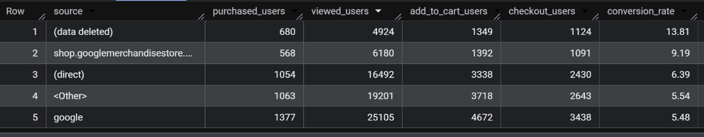
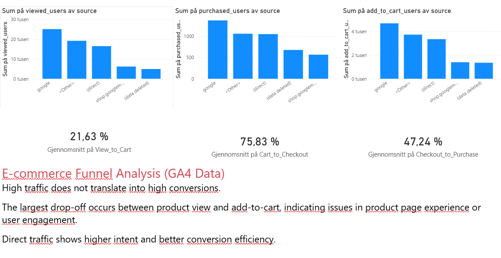

# E-commerce Conversion Analysis (GA4 + BigQuery)

## 📊 Overview

This project analyzes user behavior in an e-commerce funnel using Google Analytics 4 (GA4) data in BigQuery. The goal is to understand how users move through the purchase process and identify where drop-offs occur.


## 🎯 Business Problem

The company receives strong traffic but experiences significant drop-offs in the purchase funnel, reducing overall conversion performance

This project aims to identify:

* Where users drop off in the funnel
* Which traffic sources perform best
* How conversion rates vary across channels


## 📁 Data

* Source: Google Analytics 4 (BigQuery public dataset)
* Table: `bigquery-public-data.ga4_obfuscated_sample_ecommerce.events_*`


## 🧠 Methodology

### Funnel Definition

* View Item
* Add to Cart
* Begin Checkout
* Purchase

### Approach

* Aggregated data at **user level** using `MAX(IF())`
* Counted users per step using `COUNTIF()`
* Calculated conversion rate using `SAFE_DIVIDE()`


## 💻 SQL (Core Query)

```sql
WITH funnel AS (
  SELECT
    user_pseudo_id,
    traffic_source.source AS source,

    MAX(IF(event_name = 'view_item', 1, 0)) AS viewed_item,
    MAX(IF(event_name = 'add_to_cart', 1, 0)) AS added_to_cart,
    MAX(IF(event_name = 'begin_checkout', 1, 0)) AS started_checkout,
    MAX(IF(event_name = 'purchase', 1, 0)) AS purchased

  FROM `bigquery-public-data.ga4_obfuscated_sample_ecommerce.events_*`
  GROUP BY user_pseudo_id, source
)

SELECT
  source,
  COUNTIF(viewed_item = 1) AS viewed_users,
  COUNTIF(purchased = 1) AS purchased_users,
  ROUND(
    SAFE_DIVIDE(
      COUNTIF(purchased = 1),
      COUNTIF(viewed_item = 1)
    ) * 100, 2
  ) AS conversion_rate
FROM funnel
GROUP BY source
ORDER BY viewed_users DESC;
```
## 📈 Funnel Performance (Step Conversion)

- View → Cart: 21.63%
- Cart → Checkout: 75.83%
- Checkout → Purchase: 47.24%


## 📈 Key Insights
* This stage represents the highest leverage point for improving overall conversion performance
* **Google** drives the highest traffic and total purchases, but has a lower conversion rate
* **Direct traffic** has a higher conversion rate, indicating stronger purchase intent
* There is a significant drop-off between *view_item* and *add_to_cart*, representing the most critical friction point in the funnel


## 📊 Dashboard (Power BI)

Below is a dashboard summarizing the funnel performance:


The dashboard highlights a major drop-off at the early stage of the funnel, particularly between product view and add-to-cart.


## 📱 Device Analysis
This confirms that conversion inefficiencies are consistent across devices, reinforcing that the issue lies within the funnel experience rather than platform differences.

## 💡 Business Recommendations
* Optimize landing pages for traffic from Google
* Improve product page experience to reduce drop-off between view and add-to-cart
* Improve targeting and ad relevance to increase conversion
* Leverage direct traffic through loyalty programs and retention strategies

### Purchase Funnel Visualization

Below is a funnel visualization showing user drop-off across the purchase journey.


The funnel visualization reveals a substantial decline in user progression at the early stage of the purchasing journey. While a large number of users view products, only a small percentage continue to add items to their cart. This suggests that the primary conversion friction occurs before purchase intent is fully developed.

The relatively stronger conversion rates in later stages of the funnel indicate that users who add products to their cart are significantly more likely to continue toward checkout and purchase.

## 🚀 Skills Demonstrated

* SQL (BigQuery)
* Funnel Analysis
* Conversion Rate Analysis
* Data Aggregation (user-level)
* Business Insight Generation

## 🚀 Key Takeaway

The highest-impact opportunity is improving the transition from product view to add-to-cart.

Even small improvements at this stage can significantly increase overall revenue due to the high drop-off rate.
