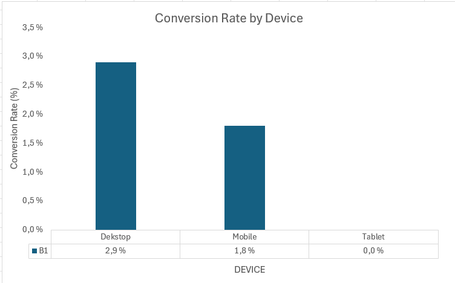

# E-commerce Conversion Analysis (GA4 + BigQuery)

## Overview
This project analyzes user behavior in an e-commerce funnel using GA4 BigQuery data. The goal is to understand conversion performance across devices and identify opportunities to improve revenue.

---

## Data
- Source: Google Analytics 4 (BigQuery public dataset)
- Table: `ga4_obfuscated_sample_ecommerce.events_*`

---

## Methodology
- Funnel: view_item → purchase
- Aggregated at user level using `MAX(IF())`
- Converted events into binary flags (1/0)
- Calculated totals using `SUM()`
- Conversion rate calculated using `SAFE_DIVIDE`

---

## Results (Conversion Rate by Device)

| Device  | Conversion Rate |
|--------|----------------|
| Desktop | 2.9% |
| Mobile  | 1.8% |
| Tablet  | 0.0% |

---

## Visualization



---

## Key Insights
- Desktop converts significantly higher than mobile
- Mobile conversion is ~40% lower → indicates UX issues
- Tablet shows no conversions (low volume or poor experience)

---

## Business Recommendations
- Improve mobile checkout experience
- Optimize page speed for mobile users
- Test mobile-specific UX improvements (A/B testing)

---

## SQL (Core Query)

```sql
WITH funnel AS (
  SELECT
    user_pseudo_id,
    device.category AS category,
    MAX(IF(event_name = 'view_item', 1, 0)) AS view_item,
    MAX(IF(event_name = 'purchase', 1, 0)) AS purchase
  FROM `bigquery-public-data.ga4_obfuscated_sample_ecommerce.events_*`
  GROUP BY user_pseudo_id, category
)

SELECT
  category,
  SUM(view_item) AS view_item_users,
  SUM(purchase) AS purchase_users,
  SAFE_DIVIDE(SUM(purchase), SUM(view_item)) AS conversion_rate
FROM funnel
GROUP BY category
ORDER BY conversion_rate DESC;
```

---

## Tools
- BigQuery (SQL)
- Excel (Visualization)
- GA4 dataset
GROUP BY category
ORDER BY conversion_rate DESC;
