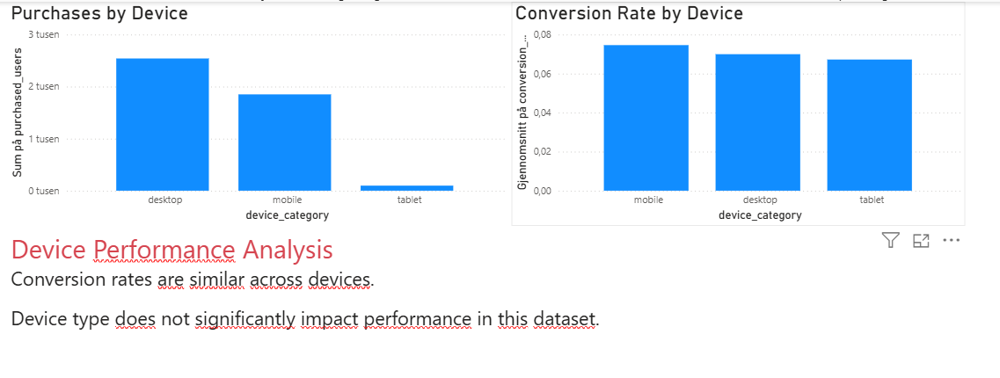
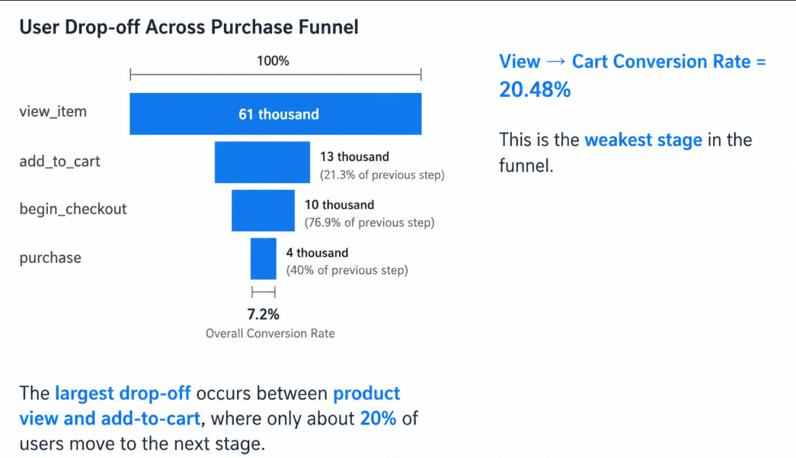

# E-commerce Funnel Analysis using GA4 and BigQuery

## Project Overview

This project analyzes user behavior in an e-commerce purchase funnel using Google Analytics 4 (GA4) data in BigQuery. The goal is to identify where users drop off before completing a purchase and how conversion performance varies across traffic sources and devices.

## Business Problem

The business receives a high number of product views, but many users do not continue toward purchase. This creates a need to understand where friction occurs in the funnel and which channels bring users with stronger purchase intent.

This project aims to answer three key questions:

- Where do users drop off in the purchase funnel?
- Which traffic sources generate the strongest conversion performance?
- Do conversion rates vary across devices?


## 📁 Data

* Source: Google Analytics 4 (BigQuery public dataset)
* Table: `bigquery-public-data.ga4_obfuscated_sample_ecommerce.events_*`


## 🧠 Methodology

### Funnel Definition

The funnel was defined using four GA4 e-commerce events:

- `view_item`
- `add_to_cart`
- `begin_checkout`
- `purchase`

### Approach

- Aggregated data at user level using `MAX(IF())`
- Counted users per funnel step using `COUNTIF()`
- Calculated conversion rates using `SAFE_DIVIDE()`
- Compared conversion performance across traffic sources and devices

User-level aggregation was used to avoid counting the same user multiple times when analyzing funnel progression.


## SQL: Conversion Rate by Traffic Source

```sql
WITH funnel AS (
  SELECT
    user_pseudo_id,
    traffic_source.source AS source,

    MAX(IF(event_name = 'view_item', 1, 0)) AS viewed_item,
    MAX(IF(event_name = 'add_to_cart', 1, 0)) AS added_to_cart,
    MAX(IF(event_name = 'begin_checkout', 1, 0)) AS started_checkout,
    MAX(IF(event_name = 'purchase', 1, 0)) AS purchased

  FROM `bigquery-public-data.ga4_obfuscated_sample_ecommerce.events_*`
  GROUP BY user_pseudo_id, source
)

SELECT
  source,
  COUNTIF(viewed_item = 1) AS viewed_users,
  COUNTIF(purchased = 1) AS purchased_users,
  ROUND(
    SAFE_DIVIDE(
      COUNTIF(purchased = 1),
      COUNTIF(viewed_item = 1)
    ) * 100, 2
  ) AS conversion_rate
FROM funnel
GROUP BY source
ORDER BY viewed_users DESC;
```
## 📈 Funnel Performance (Step Conversion)

- View → Cart: 21.63%
- Cart → Checkout: 75.83%
- Checkout → Purchase: 47.24%

## 📈 Key Insights

- The largest drop-off occurs between `view_item` and `add_to_cart`. Only 21.63% of users who viewed a product added it to their cart. This suggests that the main friction happens early in the decision-making process, before users show strong purchase intent.

- The transition from `add_to_cart` to `begin_checkout` performs relatively well, with a step conversion rate of 75.83%. This indicates that users who add products to their cart are more likely to continue toward checkout.

- The checkout stage still shows meaningful friction. Only 47.24% of users who started checkout completed a purchase, suggesting possible issues such as unexpected costs, lack of trust, payment friction, or delivery concerns.

- Google drives high traffic volume, but traffic volume alone does not guarantee strong conversion performance. This highlights the importance of analyzing both traffic quantity and traffic quality.

- Device conversion rates are relatively similar across desktop, mobile, and tablet. This suggests that the main conversion issue is more likely related to the funnel experience itself rather than one specific device type.


## 📊 Dashboard (Power BI)

Below is a dashboard summarizing the funnel performance:


The dashboard highlights a major drop-off at the early stage of the funnel, particularly between product view and add-to-cart.


## 📱 Device Analysis
This confirms that conversion inefficiencies are consistent across devices, reinforcing that the issue lies within the funnel experience rather than platform differences.

## 💡 Business Recommendations
* Optimize landing pages for traffic from Google
* Improve product page experience to reduce drop-off between view and add-to-cart
* Improve targeting and ad relevance to increase conversion
* Leverage direct traffic through loyalty programs and retention strategies

### Purchase Funnel Visualization

Below is a funnel visualization showing user drop-off across the purchase journey.


The funnel visualization reveals a substantial decline in user progression at the early stage of the purchasing journey. While a large number of users view products, only a small percentage continue to add items to their cart. This suggests that the primary conversion friction occurs before purchase intent is fully developed.

The relatively stronger conversion rates in later stages of the funnel indicate that users who add products to their cart are significantly more likely to continue toward checkout and purchase.

## 🚀 Skills Demonstrated

* SQL (BigQuery)
* Funnel Analysis
* Conversion Rate Analysis
* Data Aggregation (user-level)
* Business Insight Generation


- Google drives high traffic volume, but traffic volume alone does not guarantee strong conversion performance. This highlights the importance of analyzing both traffic quantity and traffic quality.

- Device conversion rates are relatively similar across desktop, mobile, and tablet. This suggests that the main conversion issue is more likely related to the funnel experience itself rather than one specific device type.
