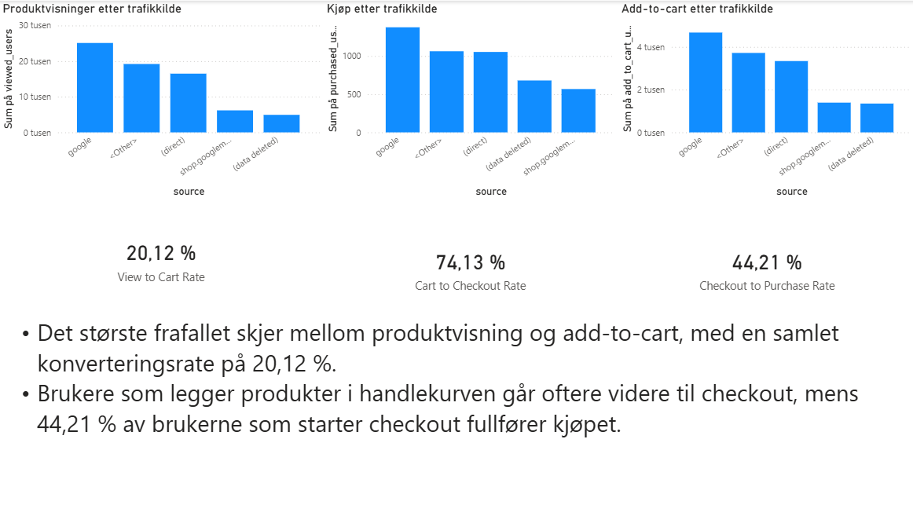
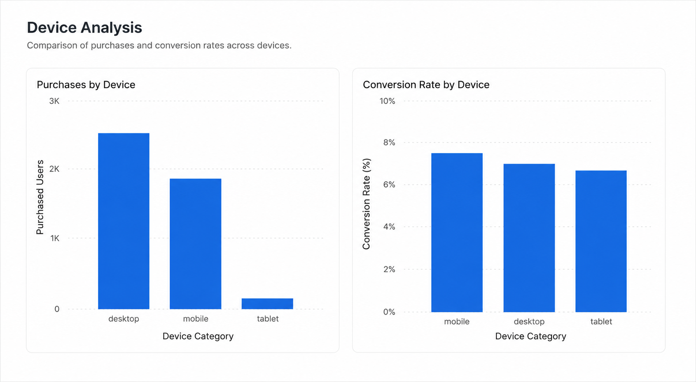

# Konverteringsanalyse for nettbutikk

**GA4 | BigQuery | SQL | Power BI**

I dette prosjektet analyserer jeg kjøpsreisen i en nettbutikk ved hjelp av data fra Google Analytics 4. Målet var å finne ut hvor brukerne faller fra før kjøp, og om konverteringen varierer mellom trafikkilder og enheter.

## Problemstilling

Analysen tar utgangspunkt i tre spørsmål:

- Hvor i kjøpsreisen faller flest brukere fra?
- Hvordan varierer trafikk og kjøp mellom ulike trafikkilder?
- Er det tydelige forskjeller i konvertering mellom enheter?

## Datagrunnlag og metode

Analysen bruker Googles offentlige GA4-datasett i BigQuery:

`bigquery-public-data.ga4_obfuscated_sample_ecommerce.events_*`

Kjøpsreisen ble definert med fire hendelser:

`view_item → add_to_cart → begin_checkout → purchase`

Jeg aggregerte data på brukernivå med `MAX(IF())` for å unngå at gjentatte hendelser fra samme bruker ble telt flere ganger.

Deretter brukte jeg blant annet `COUNTIF()` og `SAFE_DIVIDE()` for å beregne antall brukere og konverteringsrater.

## SQL-eksempel

Eksemplet under beregner konvertering fra produktvisning til kjøp per trafikkilde.

```sql
WITH funnel AS (
  SELECT
    user_pseudo_id,
    traffic_source.source AS source,

    MAX(IF(event_name = 'view_item', 1, 0)) AS viewed_item,
    MAX(IF(event_name = 'add_to_cart', 1, 0)) AS added_to_cart,
    MAX(IF(event_name = 'begin_checkout', 1, 0)) AS started_checkout,
    MAX(IF(event_name = 'purchase', 1, 0)) AS purchased

  FROM `bigquery-public-data.ga4_obfuscated_sample_ecommerce.events_*`
  GROUP BY user_pseudo_id, source
)

SELECT
  source,
  COUNTIF(viewed_item = 1) AS viewed_users,
  COUNTIF(purchased = 1) AS purchased_users,

  ROUND(
    SAFE_DIVIDE(
      COUNTIF(purchased = 1),
      COUNTIF(viewed_item = 1)
    ) * 100,
    2
  ) AS conversion_rate

FROM funnel
GROUP BY source
ORDER BY viewed_users DESC;
```

## Viktigste funn

Den største reduksjonen i antall brukere skjer tidlig i kjøpsreisen.

- **20,12 %** gikk fra produktvisning til handlekurv.
- **74,13 %** gikk fra handlekurv til checkout.
- **44,21 %** gikk fra checkout til kjøp.
- Samlet konvertering fra produktvisning til kjøp var omtrent **6,60 %**.

Resultatene viser dermed at det største forbedringspotensialet ligger mellom produktvisning og handlekurv.

## Dashboard

Power BI-dashboardet viser trafikk og kjøp fordelt på trafikkilde, sammen med konverteringen mellom stegene i kjøpsreisen.



Google står for flest produktvisninger i datasettet, men analysen viser også hvorfor trafikkvolum alene ikke er nok til å vurdere kvaliteten på en trafikkilde. Konvertering må vurderes sammen med volum.

## Analyse etter enhet

Jeg undersøkte også om konverteringen var tydelig forskjellig mellom desktop, mobil og nettbrett.



Resultatene viste relativt små forskjeller i konverteringsrate mellom enhetene. Det tyder på at frafallet tidlig i kjøpsreisen ikke kan forklares av én bestemt enhet alene.

## Anbefalinger

Basert på analysen ville jeg prioritert å undersøke steget mellom produktvisning og handlekurv nærmere.

Aktuelle neste steg kan være:

- teste produktinformasjon og plassering av kjøpsknappen
- undersøke om pris, frakt eller levering er tydelig nok på produktsiden
- sammenligne konvertering mellom trafikkilder mer detaljert
- bruke A/B-testing eller brukerundersøkelser for å finne årsaken til frafallet

Analysen viser **hvor** det største frafallet skjer, men ikke alene **hvorfor** det skjer. Derfor bør årsaken testes før større endringer gjennomføres.

## Begrensninger

Datasettet er et offentlig og anonymisert GA4-eksempeldatasett. Analysen inneholder derfor ikke blant annet markedsføringskostnader, marginer eller kundedata som ville vært tilgjengelig i en reell virksomhet.

Funnel-analysen er aggregert på brukernivå (`user_pseudo_id`). Den identifiserer om en bruker har utført de ulike funnel-hendelsene i analyseperioden, men sikrer ikke at hendelsene skjedde i samme sesjon eller i en bestemt kronologisk rekkefølge. En videre analyse kan bygge en session-basert sekvensiell funnel ved hjelp av `ga_session_id` og `event_timestamp`.

Resultatene bør derfor brukes som et analyseeksempel, ikke som faktiske forretningsresultater.

## Verktøy og ferdigheter

- SQL og BigQuery
- Google Analytics 4
- Power BI
- Funnelanalyse
- Konverteringsanalyse
- Brukerbasert aggregering
- Datavisualisering
- Analyse og anbefalinger
